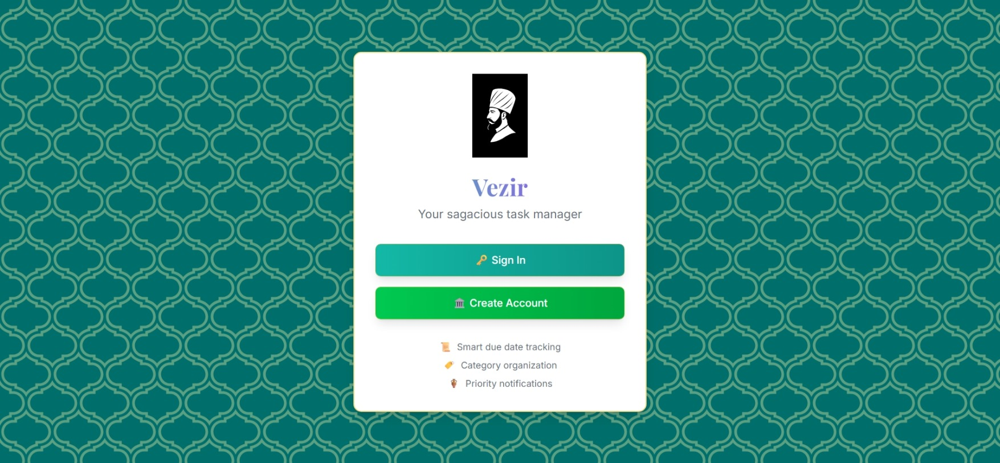
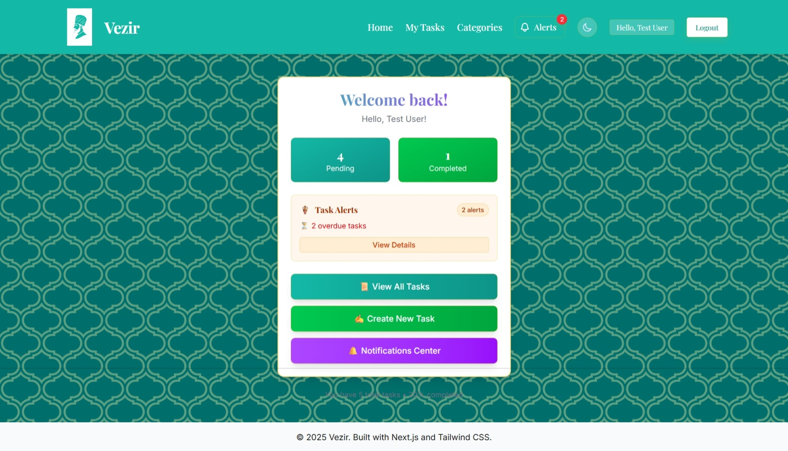
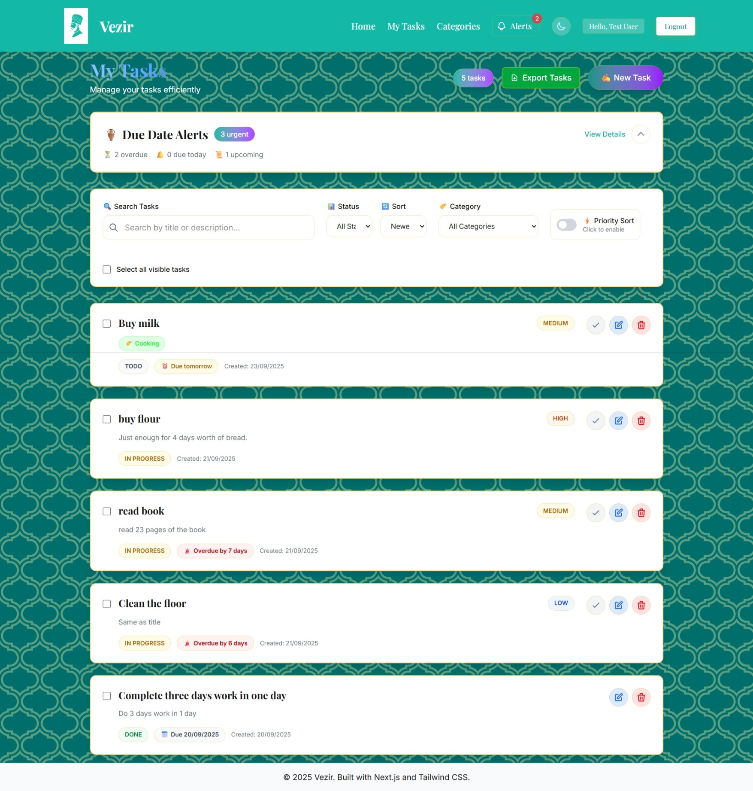
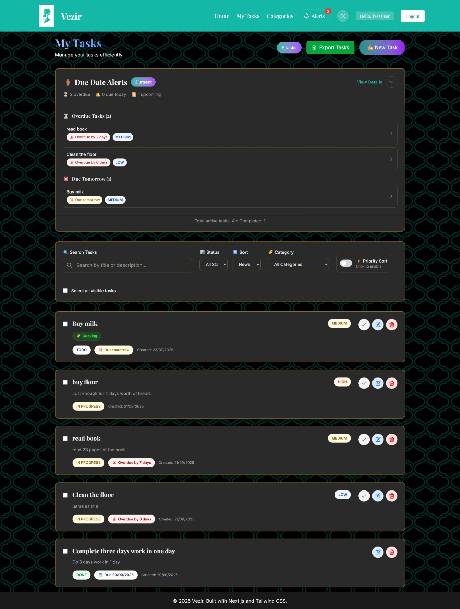
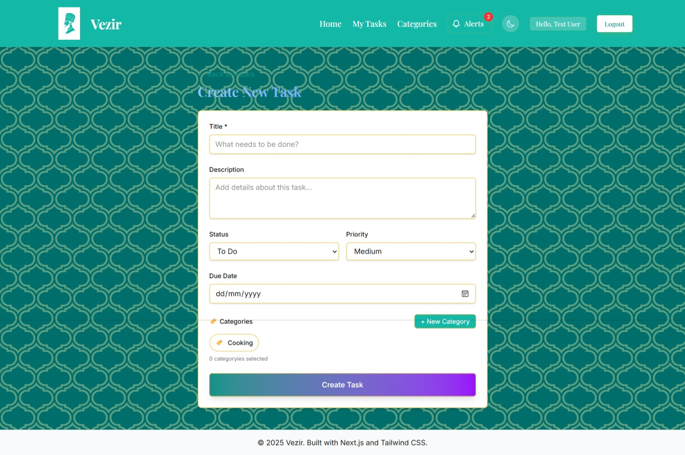
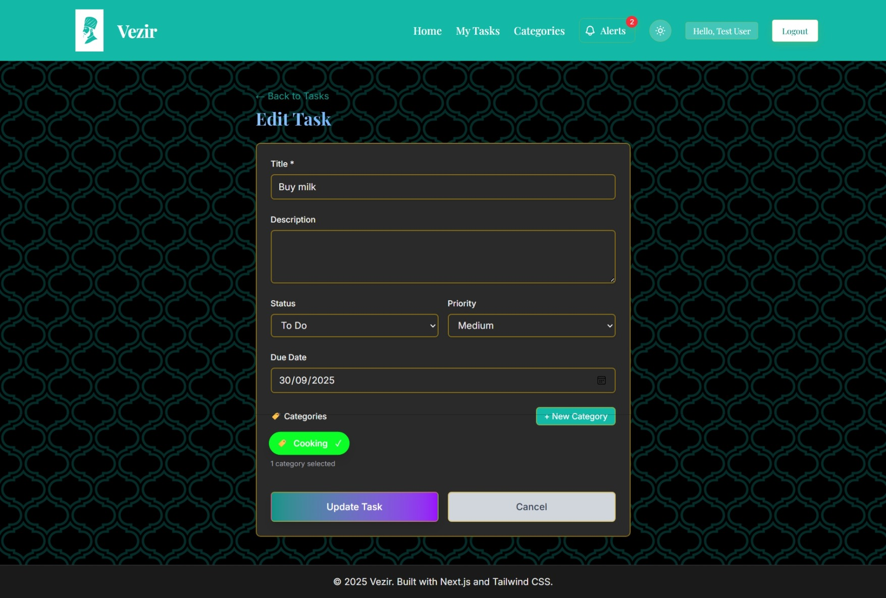
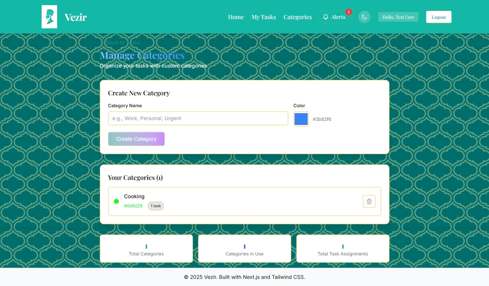
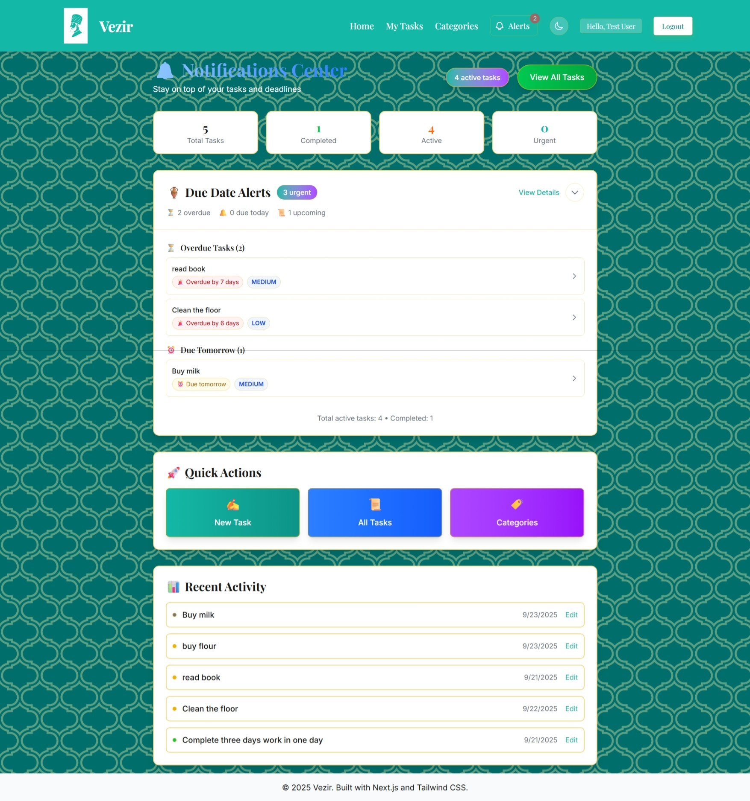
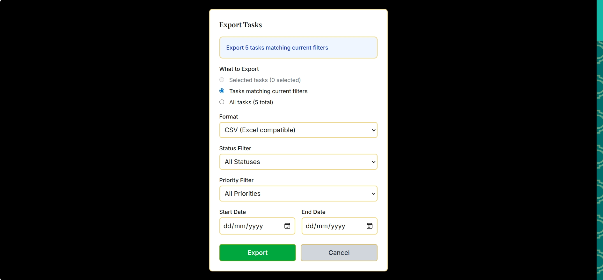

# Vezir - Task Manager

A modern task management app with authentication, categories, and smart notifications.

## 🚀 Live Demo

[**View Live Application**](https://vezir-alpha.vercel.app/)

## 📸 App Preview

| Feature | Screenshot |
|---------|------------|
| **Welcome Page** |  |
| **Home Dashboard** |  |
| **Task Management** |  |
| **Dark Mode Tasks** |  |
| **Create Task** |  |
| **Edit Task (Dark)** |  |
| **Categories** |  |
| **Notifications** |  |
| **Export Tasks** |  |

## ✨ Features

- **User Authentication** - Secure login/registration with session management
- **Task Management** - Create, edit, delete tasks with priority levels
- **Smart Categories** - Custom categories with color coding and task counts  
- **Due Date Notifications** - Smart alerts for overdue, today, and upcoming tasks
- **Data Export** - Export tasks to CSV and JSON formats
- **Dark/Light Mode** - Seamless theme switching
- **Desktop Optimized** - Professional interface designed for desktop use

## 🛠️ Tech Stack

- **Frontend**: Next.js 15, React, TypeScript, Tailwind CSS
- **Backend**: Next.js API Routes, NextAuth.js Authentication
- **Database**: PostgreSQL with Prisma ORM
- **Deployment**: Vercel Platform
- **Styling**: Tailwind CSS with custom design system

---

*Built with modern web technologies and best practices*